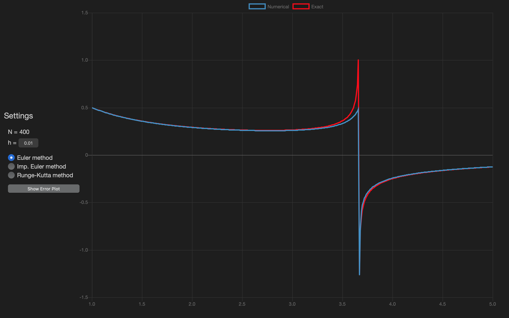

# Differential Equations Practicum BS17-08

Following repo contains full solution of computational practicum

## 0. Initial Equation

Given this equation:


## 1. Exact Solution

The exact solution is (if initials x0 = 1 and y0 = 0.5):


## 2. Asymptotes

By solving 


We observe that x = 0 and x = 11 / 3 are asymptotes. This is used when computational algo goes to x{k} - x{asymptote} <= eps, it jumps on delta and recomputes value by exact solution to continue computing values after this asymptote.

## 3. Live demo

Here is the _demo graph_.

**Graph** as well is scrollable and draggable; Field near **h =** is also scrollable (vertically) to change its value and you also can change it as in text input.

_Imp. Euler Method_ is **Improved Euler Method**.

You also can switch from error to solution plot.

**!** All values are dynamic, e.g setting **h** and then changing plot to error will show you error plot with from graph with this **h** value.

* __Error plot__ is local truncation error representation.

[](https://geowatson.github.io/de/)

### Used techs

*  JavaScript
*  HTML, CSS

### Used libs

* <a href="https://www.chartjs.org">Chart.JS</a>

P.S. All other stuff (scrolling and dragging on graph, scrolling on **h** and cool _десигн_) was designed by myself.

### Project hierarchy

* ```index.html``` - Page content descriptor (or just HTML file)
* ```script.js``` - Dynamic library descriptor (or just JS file)
* ```style.css``` - Cascade style sheets (or just CSS file)
* ```chart.js``` - JS file, provided by <a href="https://www.chartjs.org">Chart.JS</a>
